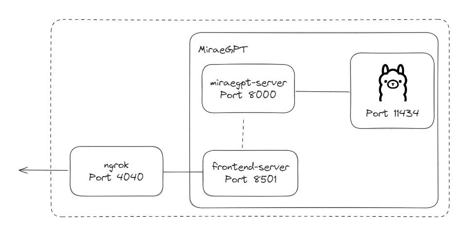

# Deployment

## Overview

1. Create a file `.env` in root folder. Ensure all values are provided. 
2. Set up Ollama server first.
    - Ensure `~/.ollama` folder exist in the local server. 
    - Ensure that the necessary models are pulled in.
3. Set up miraegpt-server
4. Set up frontend-server
    - Note that the Backend URL directly refers to the `/invoke` endpoint.
5. Set up ngrok
    - Ensure that the ngrok url points to the frontend URL using the command

        > http --domain ${NGROK_URL} frontend-server:8501

## Procedure
1. Login to the local server running in the office, either by ssh or remote connection. 
2. Pull the latest changes from Github, if any.
3. Add any environment variables or config files required, if any.
4. Run the following command to stop the current application
> docker compose down
5. Run the following command to rebuild any images and serve the application
> docker compose up --build