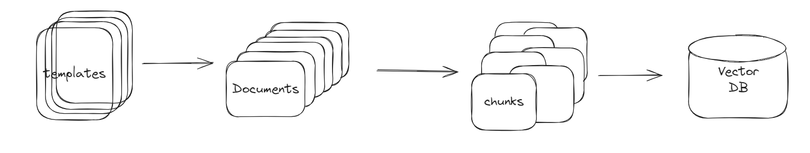

# Database

## Location
```bash
./
└── miraegpt/
    ├── database/
    │   └── chroma.py
```

## Description



As seen from the diagram above,  

1. Templates are saved in `data/templates`.  
2. Using `load_word_documents`, we load the word documents.  
    - Here, we used the package `unstructured` to help us with the loader.  
    - Every template will be loaded with 2 attributes,`page_content` and `metadata`.   
    - In `metadata`, we would also include other useful information like `source` which is the filename of the template and also `issue_type` which we can get from the [name of the template](../developer/data.md#description). 
3. Then using `chunk_documents`, the documents from step 2 will be recursively chunked into smaller byte size.
    - The chunk id will also be added as part of the metadata

4. Subsequently, the chunks will be written into the vectorstore using `write_to_vectorstore`. 
    - Note that we are using the embedder `mxbai-embed-large` from the local Ollama. So do ensure that Ollama server is running locally and the embedder is pulled to your local machine.

## Adding new templates
The following instructions allow developers to add new SAV templates. As there might be more SAV templates being generated, this guide allows developers to add the new SAV template into the existing database.

*If developers is looking to add other form of templates **(Not SAV)**, you might need to come up with a new workflow. You can still use the pre-existing functions available but do not use it blindly as you might add the wrong templates into the vector store.*

### Procedure
1. Save each new template as a individual word document in `./miraegpt/data/templates/{type of template}`.  
    - Ensure you save it in the correct template type folder.
    - Ensure to name the file in this format

        > {template id}{WHITESPACE}{ISSUE TYPE}.docx

2. Open your terminal and run the following command in root to update the database

    > python3 miraegpt.database.chroma

3. Commit and push the new database and template to Github. 
4. [Redeploy](../deployment.md#procedure) the entire application.

### Possible Improvements
While developing the application, there isn't sufficient time to develop an application for ecomms team to add new templates and have it automatically saved in the database. As such, developers have to come in to update the database manually. 

Hence, it is possible to include a frontend for ecomms teams to add new templates, and send the file over to the backend where it would process and save the new templates in the database. 