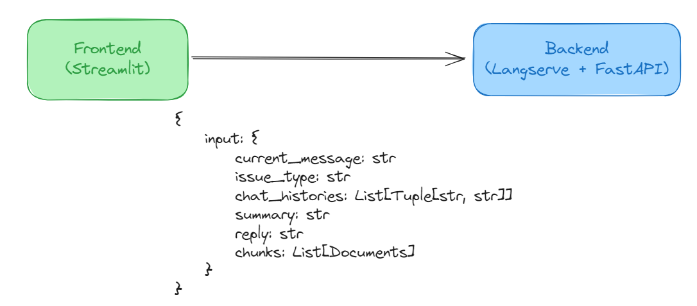
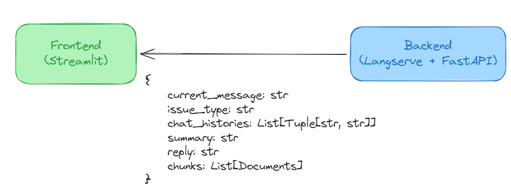

# Frontend

## Prerequisites
The application's frontend is built using Streamlit. Please look through [Streamlit's documentation](https://docs.streamlit.io/). At the very least, please understand the tools and concepts from:

- [Build a basic LLM chat app](https://docs.streamlit.io/develop/tutorials/llms/build-conversational-apps)
- [Session State](https://docs.streamlit.io/develop/concepts/architecture/session-state)

## Folder Structure
```bash
./
└── frontend/
    ├── app.py
    ├── Dockerfile
    └── requirements.txt
```

## Set up
### Without Docker
1. In the `frontend` folder, there should be a `requirements.txt` file. Run the following command:
> pip install requirements.txt
2. Once all dependencies are installed, serve the frontend at port `8501` by running
> streamlit run app.py

### With Docker
1. Build the Docker Image with the `Dockerfile` in `frontend` folder with the image name `frontend-server` 
2. Run the Docker Image as container. 

**Note: The Docker Image does not have its volume attached to the frontend folder. As such, every changes would require the image to be rebuild and container to be rerun.** You can edit the Dockerfile to attached the volume to the frontend folder to avoid rebuilding the image.

## Connection to Backend
If you are developing the frontend and wishes to access the backend, you have to ensure that the backend is up and running. 

### Using Docker
Suppose you are developing using docker and specifically using the docker compose file, the Backend URL has already been configured to `http://miraegpt-server:8000/gpt/invoke`. 

### Local
Otherwise, if you are developing locally without docker, the backend url is defaulted to `http://0.0.0.0:8000/gpt/invoke`. 

Regardless how you are developing, just ensure that the backend server is listening to port `8000` and it should be fine. 

## Design

### Request


The frontend application will send a request to the backend url with the request body as shown above.

### Response


The backend application will send back a response. The `generate_response` in `frontend/app.py` file will handle the response body to output the JSON as shown above. 

### Memory Management
The frontend uses Streamlit's session state to store 2 attributes

- messages - list of message and role
- graph_state - current state of an Output Object, used for Request Body and updated using Response Body.

As Streamlit's session state depends on the memory of the browser tab and **does not persist any data**, every time a new tab is opened or when the tab refreshes, the session state will be **cleared** and fallback to its default values. 

### Flow
1. User types in their question.
2. Question is saved in `messages` with the role as `user`.
3. Question is posted to the Backend Server using `generate_response` function. 
4. With the Backend Server's response, the `graph_state` is updated.
5. Find the relevent sources used by the Backend.
6. Output the responses and relevent sources.
7. Response saved in `messages` with the role as `assistance`.


