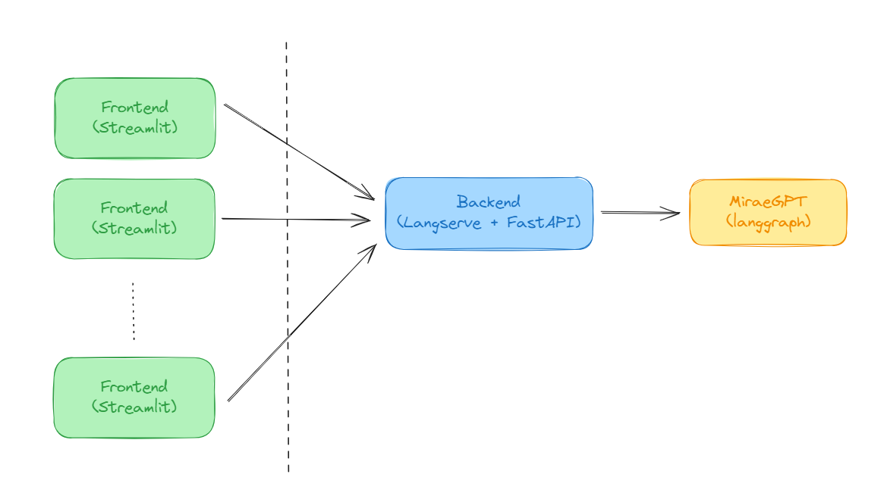

# Overall Architecture

There can be multiple frontend clients. Each client is essentially a browser tab (which can exists on multiple devices). Every time the client posted a question, the question will be posted to the Backend server via an API call. Once the Backend server received the question posted, it will redirect the questions to MiraeGPT which will do most of the heavy lifting. We will discuss each component in greater details. 