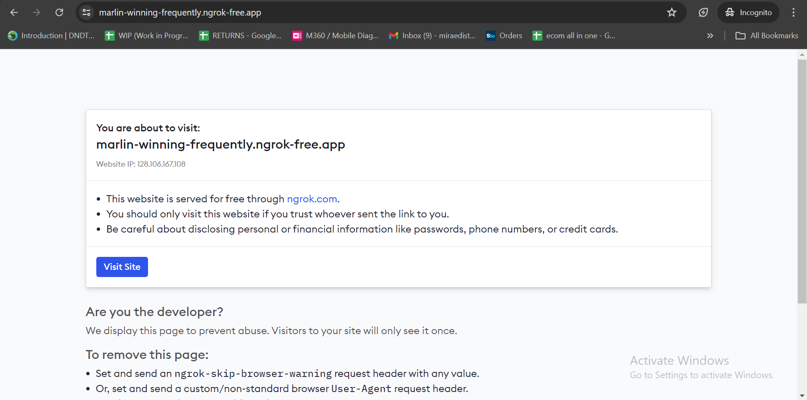

# User Guide

## Prerequisite
Please ensure that you have read through this [ecomms notes](https://docs.google.com/document/d/1s1b0FkAROP_YMSLDiVSGTnAVqHMvGcpvR7EX9XFqEvg/edit?usp=sharing). Otherwise, please read through that first. 

## Getting Started
1. Go to [MiraeGPT](https://marlin-winning-frequently.ngrok-free.app/)
2. If you see the following page, click on `Visit Site`. Otherwise, go to step 3.

3. Once you see the following page, you can start asking your questions.

## Using MiraeGPT
MiraeGPT is designed to work like ChatGPT but specifically for crafting replies for Backmarket's SAV.

Here is an example:

Suppose Backmarket asked
> Hi ecomobile, Could you please contact UPS to find out why the parcel wasn't delivered?

You should try and paraphrase the questions using keywords you saw by reading the [ecomms notes](https://docs.google.com/document/d/1s1b0FkAROP_YMSLDiVSGTnAVqHMvGcpvR7EX9XFqEvg/edit?usp=sharing) and the context of the SAV situation. 

Suppose the context is 
> The parcel is marked delivered but the customer did not received the parcel. 

Then you should paraphrase the question as 
> The customer has yet to received their parcel despite parcel being marked as delivered.

Then, enter the paraphrased question into the input box.

Subsequently, you will get a response back from MiraeGPT. 

You can use/edit the response provided by MiraeGPT before sending it back to Backmarket. 

In the event where MiraeGPT did not provide you with a desired response, you can rephrase your questions again. For example, 
> Could you help me craft a response to Backmarket?

  <strong>Important:</strong>
  
While MiraeGPT is able to provide you a response, you still have to do your <b>due diligence </b> to ensure that the response provided by MiraeGPT is valid.

### Cross Reference
Suppose you want to cross validate MiraeGPT's response, MiraeGPT will provide sources which it has referenced from. For example,

You can follow the sources and find the template used in the [ecomms notes](https://docs.google.com/document/d/1s1b0FkAROP_YMSLDiVSGTnAVqHMvGcpvR7EX9XFqEvg/edit?usp=sharing)

### Dealing with Multiple SAVs
Currently, 1 MiraeGPT browser tab is efficient in dealing with 1 SAV. Suppose you are handling multiple SAVs, you should **open another tab** of MiraeGPT and ask your new questions there.

+ This is because every tab of MiraeGPT keeps track of its chat history. When answering your question, it will look at the chat history to get the context before providing a response. As such, asking it to handle multiple SAVs might cause it to perform poorly.

  <strong>Note:</strong> 
  
If you don’t understand the explanation above, its fine, just remember

  
<b><i>For every new issue, open a new tab of MiraeGPT</i></b>

